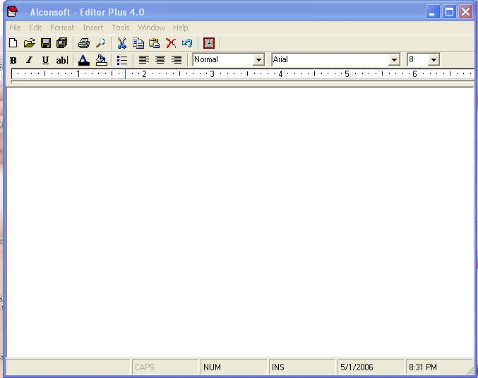



## Editor Plus ver 4\.0

### Description

With Alconsoft Editor Plus, you can create and edit simple text documents or documents with complex formatting and graphics.You can save your Editor Plus file as a text file, rich text file, text file for MS-DOS, Unicode. These formats provide greater flexibility when working with other programs. Documents that use multiple languages should be saved as rich text files.

Features Include:

1.Create

Rich Text Format (RTF)

Text File (TXT, LOG)

Documet File (DOC),etc..

2.Open with your files just double click(Assosiate with Editor Plus) ..

3.Insert

Image Files

Current System Date &amp; Time

4.Text Formating

Bold,Italic,Underline,Strike,Bullets

Alignmets (Left,Right,Center)

Fore Color,Back Color,Fonts

5.Open Other Applications

MS-Paint

MS-Calculator

6.File Security Support

Encryption,Decryption .

7.Spelling and Grammer Check (if MS-Word Installed).

8.Tab and Ruler Included

If you have any suggestions or comments please email us at manojbabu@sancharnet.in Thank You for using this software : Alconsoft All Rights Reserved.

E-mail: alconsoft@yahoo.com          Web Site: http://www.geocities.com/alconsoft/
 
### More Info
 

             |
---                |---
**Submitted On**   |2006-05-01 20:36:08
**By**             |[MANOJBABU](https://github.com/Planet-Source-Code/PSCIndex/blob/master/ByAuthor/manojbabu.md)
**Level**          |Intermediate
**User Rating**    |4.5 (36 globes from 8 users)
**Compatibility**  |VB 6\.0
**Category**       |[Complete Applications](https://github.com/Planet-Source-Code/PSCIndex/blob/master/ByCategory/complete-applications__1-27.md)
**World**          |[Visual Basic](https://github.com/Planet-Source-Code/PSCIndex/blob/master/ByWorld/visual-basic.md)
**Archive File**   |[Editor\_Plu199143522006\.zip](https://github.com/Planet-Source-Code/manojbabu-editor-plus-ver-4-0__1-65188/archive/master.zip)

